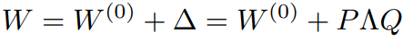

# AdaLoRA: Adaptive Budget Allocation for Parameter-Efficient Fine-Tuning
> [2303.10512](https://arxiv.org/abs/2303.10512) 
> AdaLoRA

## Summary

`LoRA` (works well) + `SVD` (can monitor module-importance)  &rarr; `AdaLoRA` (SVD-based, rank-adaptive LoRA)

## Tech Insights

1. AdaLoRA mostly outperfom LoRA by a few
   > with a complex algorithm overhead, I don't recommend implement AdaLoRA if not having serious budget issue.
2. Different modules contribute to FT performance differently
   > FFN modules > Attention modules 
   > Top layers > Bottom layers
3. The [resulting budget distribution](/#3-the-resulting-budget-distribution) support previous researches
---

## Motivation

1. Growing recognition (through empirical studies): `Different layers contribute differently` and an adaptive allocation could yield better performance per parameter budget.
   > FFN layers and top layers are often more impactful to fine-tuning performance than others
3. Existing PEFT approaches assigned an `uniform rank` (parameter budget) across all weight matrices/layers, ignoring the fact that certain modules (e.g. FFN layers, top  layers) are much more task‑critical.

## Experiment
### 1. Different modules contribute to FT performance differently
- FFN modules > Attention modules
- Top layers > Bottom layers

### 2. Comparison among FFT, LoRA, and AdaLoRA
- AdaLoRA mostly outperfom LoRA by a few
  > Section 4 in the original paper

### 3. The resulting budget distribution

